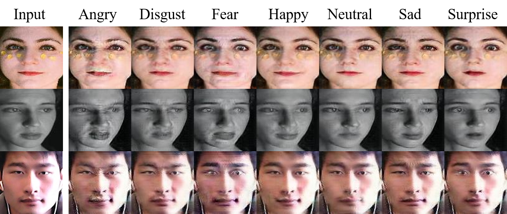

# StarGan
使用StarGan网络，数据集RAF-DB，生成7种表情。

代码参考于[StarGan](https://github.com/yunjey/stargan)。


## 结果




## 数据集

> * 下载数据集 [Real-world Affective Faces Database](http://www.whdeng.cn/raf/model1.html)，须按照说明获得授权。
> * 使用其中对齐后的人脸，即文件夹`basic/Image/aligned`下的数据。
> * 使用本项目提供的label.txt，放到上述文件夹下，即与图片同一目录。

> * 在convert_rafdb.py修改相应路径，然后运行。
>
>   dataset_path：原始数据集所在路径
>
>   new_dirs：新生成的数据集保存目录

最终生成的数据集目录结构如下：

> ```shell
> RAFdb
>  |-- |-- train
>      |   |-- Angry
>      |   |   |-- xxxxx.jpg
>      |   |   |-- ...
>      |   |-- Disgust
>      |   |   |-- ...
>      |   |-- ...
>      |-- test
>      |   |-- ...
> ```


## 训练

根据自身需求，修改main.py中的默认设置，或运行时添加。

```shell
python main.py --num_iters 200000 batch_size 32 --rafd_image_dir ../Datasets/RAFdb_TSF/train 
```


## 测试

修改test.py里的测试图片路径img_path。

```shell
python test.py
```